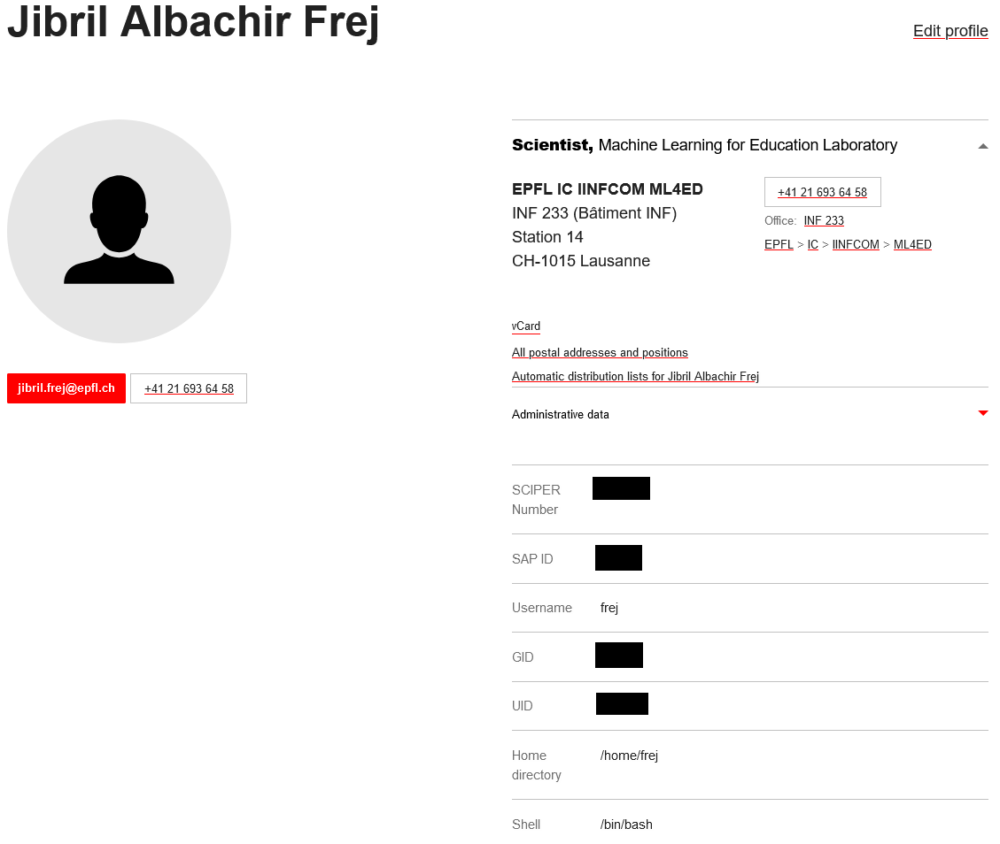

# RunAI Tutorial

Before following this tutorial, if you are not familiar with docker we highly recommend that you get familiar with docker.

You do not need to be an expert but you need to know:

1. What is a Docker image
2. What is a Docker container
3. How to read a Dockerfile

This [video](https://www.youtube.com/watch?v=eGz9DS-aIeY&t=660s) might help.

## Disclaimer

<details>

<summary>Disclaimer</summary>

This tutorial has been made on windows with WSL 2 (ubuntu).

If you are on Mac, Windows or another distribution and some of the commands are not recognized, you might need to change them. For example 'sudo service docker start' will not work on Mac or on the Powershell of Windows (on Mac, you can instead open Docker Desktop and then wait for the Docker engine to start).

Remember to use a search engine or a chatbot to help.

</details>

## Overview

Here are the main steps to run a job on the cluster using RunAI:

1. Write your scripts (train, eval, preprocessed, etc...)
2. Write and build a docker image that can run your scripts
3. Upload your image on EPFL's ic registry (it will be available on the cloud)
4. Run the image on the cluster using RunAI

Remember to make sure that your scripts and docker are working locally before submitting anything to the cluster (think twice, compute once).

## Basic docker image

<details>

<summary>Basic image</summary>

In this section, we will see how to build and run a simple docker image that saves a text file on you local machine using python.

Below is the Dockerfile

```Docker
# Use the minimalistic Python Alpine image for smaller size.
FROM python:3.9-alpine

# Set the working directory in docker
WORKDIR /app

# Create a directory for the data volume
RUN mkdir /data

# Copy the Python script into the container at /app
COPY write_text.py .

# Always use the Python script as the entry point
ENTRYPOINT ["python", "write_text.py"]

# By default, write "hello world" to the file.
CMD ["--text", "hello world"]
```

Starting docker (as said before, Mac users can also just start the Docker Desktop app and then wait for the Docker Engine to be started)

```bash
sudo service docker start
```

Build a Docker image with the tag helloworld-image from the current directory (indicated by the . at the end).

```bash
docker build -t helloworld-image .
```

Run the image. Will execute the ENTRYPOINT with the default parameter in CMD.

```bash
docker run helloworld-image
```

Nothing is created on our machine.

To deal with this: option -v maps a directory from your local machine (host) to a directory inside the container.

```bash
docker run -v $(pwd):/data helloworld-image
```

But our python script has an argument: "--text"

If we specify it in when running the container, it will override CMD (the default value)

```bash
docker run -v $(pwd):/data helloworld-image --text="New Hello Word"
```

If you want to remove all your docker images

```bash
docker system prune -a
```

</details>

## RunAI with basic docker image

### Run the docker image with RunAI

<details>

<summary>Running image with RunAI</summary>

First let us login to RunAI

```bash
runai login
```

You should be prompted with a link to get a password.

If you receive "Fail to get cluster version" or "configmaps is forbidden" warnings, you should ask another lab member who already has access to RunAI to give you the necessary rights to push to your lab's project (for ML4ED, it's `d-vet`) on ic-registry.
If you don't follow this step, you will receive the "namespaces is forbidden" error when pushing your image later.

Now let us login to the registry. (try with sudo if does not work)

```bash
docker login ic-registry.epfl.ch
```

Use your Tequila credentials.

Tag your image to the ic-registry, replace d-vet by your lab, otherwise, you will not be able to push.

```bash
docker tag helloworld-image ic-registry.epfl.ch/d-vet/helloworld-image
```

If you forgot the name of your image:

```bash
docker images
```

Now we can push our image:

```bash
docker push ic-registry.epfl.ch/d-vet/helloworld-image
```

Checking the existing RunAI projects

```bash
runai list project
```

If you receive an access denied error after running the command above, run `runai config project ml4ed-frej` (replace `frej` with your Gaspar username) and try again. If the config command itself leads to an access denied error, before running the config command, you may need to replace your Kubeconfig at ~/.kube/config with the recommended version that you can find [here](https://icitdocs.epfl.ch/display/clusterdocs/Getting+Started+with+RunAI#GettingStartedwithRunAI-%60kubectl%60configurationfiles) (remember to keep a backup of the old file somewhere safe before replacing!). After replacing the config file, do the steps from `runai login` again.

Submit your job. After -p put your project name.

```bash
runai submit --name hello1 -p ml4ed-frej -i ic-registry.epfl.ch/d-vet/helloworld-image --cpu-limit 1 --gpu 0
```

How to check the job:

```bash
runai describe job hello1 -p ml4ed-frej
```

Checking the logs:

```bash
 kubectl logs hello1-0-0 -n runai-ml4ed-frej
```

How to get all jobs

```bash
runai list jobs -p ml4ed-frej
```

How to delete the job:

```bash
runai delete job -p ml4ed-frej hello2 hello1
```

How to pass the arguments ? Separate them with --

```bash
runai submit --name hello2 -p ml4ed-frej -i ic-registry.epfl.ch/d-vet/helloworld-image --cpu-limit 1 --gpu 0 -- --text="hahaha"
```

How do we get our file ?: Persistent Volumes.

</details>

### Using PVC to connect your docker image on the cluster to your lab's server

<details>

<summary>PVC</summary>

Check the name of the Persistent Volumes you lab has access to:

```bash
kubectl get pvc -n runai-ml4ed-frej
```

Launch with the pvc

```bash
runai submit --name hello1 -p ml4ed-frej -i ic-registry.epfl.ch/d-vet/helloworld-image --cpu-limit 1 --gpu 0 --pvc runai-ml4ed-frej-ml4eddata1:/data
```

It fails.

Why?

Security.

New way of launching a job on runai (change the yaml file with your IDs):

```bash
kubectl create -f runai-job-default.yaml
```

```yaml
apiVersion: run.ai/v1  # Specifies the version of the Run.ai API this resource is written against.
kind: RunaiJob  # Specifies the kind of resource, in this case, a Run.ai Job.
metadata:
  name: hello1  # The name of the job.
  namespace: runai-ml4ed-frej  # The namespace in which the job will be created.
  labels:
    user: frej  # REPLACE Tequila user
spec:
  template:
    metadata:
      labels:
        user: firstname.lastname  # REPLACE
    spec:
      hostIPC: true  # Do not change this
      schedulerName: runai-scheduler  # Do not change this
      restartPolicy: Never  # Specifies the pod's restart policy. Here, the pod won't be restarted if it terminates.
      securityContext:
        runAsUser: UID # Get this from https://people.epfl.ch/firstname.lastname
        runAsGroup: GID # Get this from https://people.epfl.ch/firstname.lastname
        fsGroup: GID # Get this from https://people.epfl.ch/firstname.lastname
      containers:
      - name: container-name  # No idea why we have this, we already have the job name
        image: ic-registry.epfl.ch/d-vet/helloworld-image # The container image to use.
        args:  # Arguments passed to the container.
        - "--text"
        - "Goodbye World"
        resources:
          limits:
            cpu: "1"  # Limit the container to use 1 CPU core.
            nvidia.com/gpu: 0  # Specifies no GPU for this container.
        volumeMounts:
        - mountPath: /data  # Path in the container at which the volume should be mounted.
          name: data-volume  # Refers to the name of the volume to be mounted.
      volumes:
      - name: data-volume
        persistentVolumeClaim:
          claimName: runai-ml4ed-frej-ml4eddata1  # The name of the PVC that this volume will use.
```

To get your UserID and GroupID, visit your profile on the EPFL website:



Where is my file? Where can I access it?
Need to see with your lab or with IC where is the PVC connected to.

</details>

## Specific details for members of the ML4ED lab

<details>

<summary>ML4ED</summary>

For ML4ED (ask me for the password):

```bash
ssh root@icvm0018.xaas.epfl.ch
```

and then it should be in: /mnt/ic1files_epfl_ch_u13722_ic_ml4ed_001_files_nfs

Bonus: on the jumpbox icvm0018.xaas.epfl.ch, our lab server is also mounted.

It is located in /mnt/ic1files_epfl_ch_D-VET
</details>
